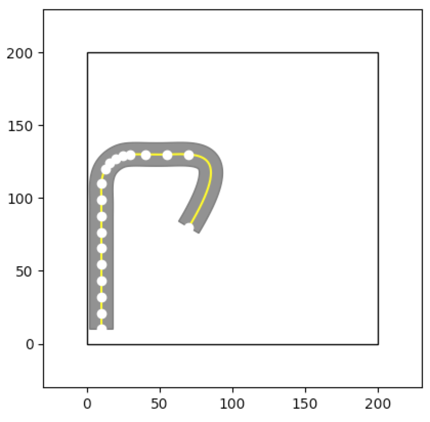

# Sample Test Generators

To illustrate the use of the code pipeline and ease the development of new test generators we provide few examples of already implemented test generators.

### One Test Generator
This test generator (`one_test_generator.py`) generates **only** one test (see the figure below) and exits.

Its purpose is to show how tests can be created from *road points* and how to force specific shapes (e.g., straight segments) even if the *road points* are interpolated.



To invoke this generator please run the following code from the root of the project (activate your `venv` before):
```
python competition.py --time-budget 10 --executor mock --map-size 200 --module-name sample_test_generators.one_test_generator --class-name OneTestGenerator
```

Change `mock` to `beamng` if you wish to run it using the BeamNG simulator (this assumes you have installed it correctly).

### Naive Random Generator
This test generator (`random_generator.py`) generates roads by sampling four points in the map between `0` and `map_size` randomly.

This test generators heavily rely on interpolation to generate the roads, it is fast, but also generates many invalid roads.


To invoke this generator please run the following code from the root of the project (activate your `venv` before):

```
python competition.py --time-budget 10 --executor mock --map-size 200 --module-name sample_test_generators.random_generator --class-name RandomTestGenerator
```

Change `mock` to `beamng` if you wish to run it using the BeamNG simulator (this assumes you have installed it correctly).


### DeepJanus Generator
This test generator (`deepjanus_seed_generator.py`) generates roads starting from the control points of Catmull-Rom cubic splines as proposed in the DeepJanus tool [1]. 

A road is defined by 10 control points in which the initial point is always at a fixed position whereas the others are placed at a random position 25 meters away from the previous one. The points of the road to be rendered in the simulator are calculated by exploiting the recursive algorithm for the evaluation of Catmull-Rom cubic splines proposed by Barry and Goldman [2] and the functionality offered by the Shapely library for manipulation and analysis of planar geometric objects.

The following figure shows that the shape of the splines is determined by the coordinates of the control points of the center line spline (marked as larger red dots).


To invoke this generator please run the following code from the root of the project (activate your `venv` before):

```
python competition.py --time-budget 10 --executor mock --map-size 200 --module-name sample_test_generators.deepjanus_seed_generator --class-name JanusGenerator
```

Change `mock` to `beamng` if you wish to run it using the BeamNG simulator (this assumes you have installed it correctly).


### References ###

[1] Vincenzo Riccio and Paolo Tonella. 2020. Model-based exploration of the frontier of behaviours for deep learning system testing. In Proceedings of the 28th ACM Joint Meeting on European Software Engineering Conference and Symposium on the Foundations of Software Engineering (ESEC/FSE 2020). Association for Computing Machinery, New York, NY, USA, 876–888. DOI:https://doi.org/10.1145/3368089.3409730

[2] Phillip J. Barry and Ronald N. Goldman. 1988. A Recursive Evaluation Algorithm for a Class of Catmull-Rom Splines. SIGGRAPH Comput. Graph. 22, 4 (June 1988), 199–204. DOI:https://doi.org/10.1145/378456.378511

