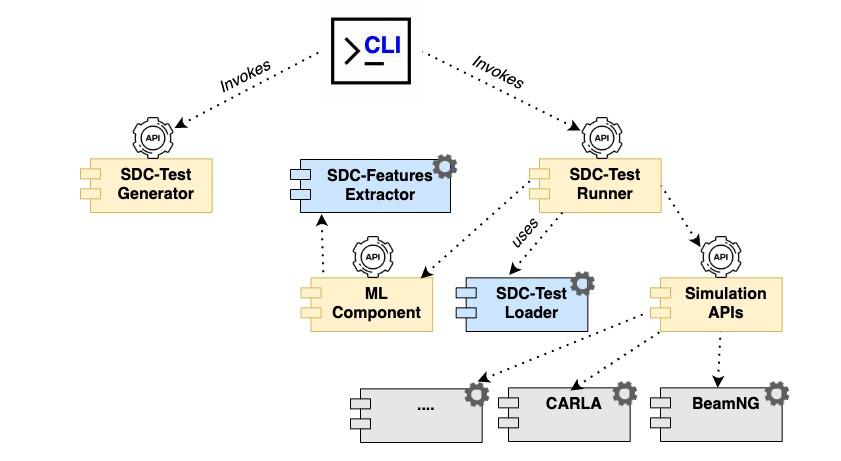

.. SDC-Scissor documentation master file, created by
   sphinx-quickstart on Mon Apr 25 10:49:01 2022.
   You can adapt this file completely to your liking, but it should at least
   contain the root `toctree` directive.

Welcome to SDC-Scissor's documentation!
=======================================
SDC-Scissor is a tool that let you test self-driving cars more efficiently in simulation. It uses a machine-learning
approach to select only relevant test scenarios so that the testing process is faster. Furthermore, the selected tests
are diverse and try to challenge the car with corner cases.

SDC-Scissor Architecture
------------------------
.. image:: ../images/sdc-scissor-architecture.jpg

SDC-Scissor Components and APIs
-------------------------------

Content
-------
.. toctree::
   :maxdepth: 2

   demo
   installation
   usage
   data
   api
