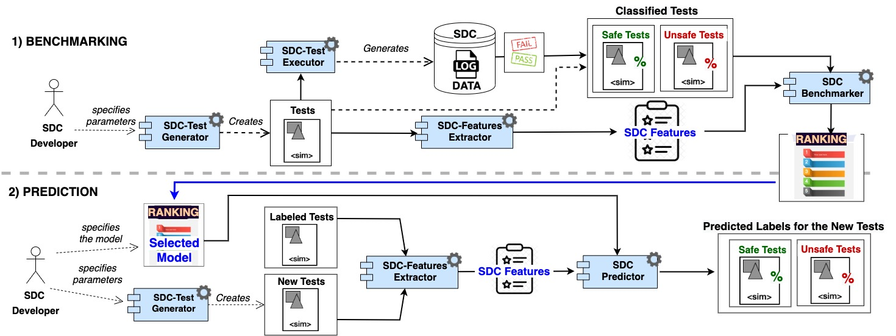

# Context
SDC-Scissor is a tool that let you test self-driving cars more efficiently in simulation. It uses a machine-learning
approach to select only relevant test scenarios so that the testing process is faster. Furthermore, the selected tests
are diverse and try to challenge the car with corner cases.

The purpose of this tool is to:

1. Provide a platform for testing self-driving cars (SDCs) within different simulators
2. Give access to different regression testing methodologies, e.g., test selection, prioritization and minimization.

## Users
SDC-Scissor has two types of users:

1. SDC testers
2. Developers of SDC software

## External Systems
* BeamNG.tech simulator
* Python
* Various dependencies from [PyPI](https://pypi.org/)
  * beamngpy
  * click
  * Shapely
  * scikit-learn
  * pymoo
