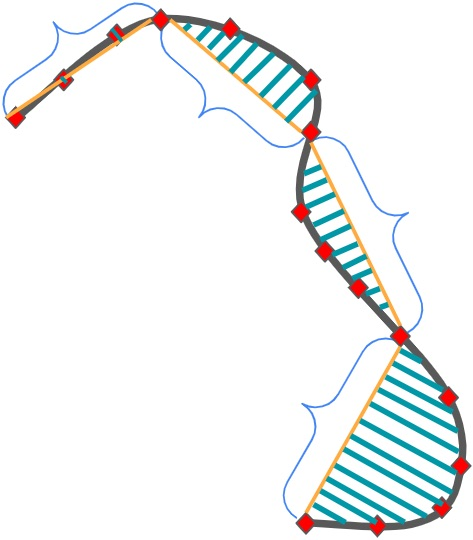

# Feature Extraction
SDC-Scissor uses road features of the test specifications for its machine learning models.
To obtain the road features, we need to extract them from the test specification with the `extract-features` command.

```text
Usage: sdc-scissor extract-features [OPTIONS]

  Extract road features from given test scenarios.

Options:
  -t, --tests PATH         Path to directory containing the tests
  -s, --segmentation TEXT
  --help
```

The following figure illustrates a road specification with its segments, direct distances of the segments sd well the spanned ares for measuring the diversity.
The exact features are described in the table below.



The command will output a CSV file describing the following features per test case:

| Feature             | Description                                                                                               |
|---------------------|-----------------------------------------------------------------------------------------------------------|
| direct_distance     | Direct distance from the start point to the end point                                                     |
| road_distance       | Distance of the road                                                                                      |
| num_l_turns         | Number of left turns                                                                                      |
| num_r_turns         | Number of right turns                                                                                     |
| num_straights       | Number of straight road segments without turns                                                            |
| median_angle        | Median turn angle of all turns of the road                                                                |
| total_angle         | Total cumulated angle of all turns                                                                        |
| mean_angle          | Mean of all turn angles                                                                                   |
| std_angle           | Standard deviation of the turn angles of the road                                                         |
| max_angle           | Maximum turn angle of the road                                                                            |
| min_angle           | Minimum turn angle of the road                                                                            |
| median_pivot_off    | Median radius of all turns of the road                                                                    |
| mean_pivot_off      | Mean arithmetic mean of all turn radius                                                                   |
| std_pivot_off       | Standard deviation of turn radius of the road                                                             |
| max_pivot_off       | Maximum radius of all turns of the road                                                                   |
| min_pivot_off       | Minimum radius of all turns of the road                                                                   |
| mean_road_diversity | Mean area of all spanned areas by segments between the actual road and the direct distance of the segment |
| full_road_diversity | Cumulative area spanned by all roads and direct distances per segment                                     |
| test_duration       | Duration of the test (not available before test execution)                                                |
| safety              | Test outcome specifying if the car was in lane or not (not available before test execution)               |

## Options
The command `extract-features` comes with several options.
Those options are mainly about to configure the feature extraction process.

```{eval-rst}
.. autofunction:: sdc_scissor.cli.extract_features
```

## Feature Statistics
To get an overview of the descriptive statistics of the extracted road features of your tests you can run the `feature-statistics` command.

```{eval-rst}
.. autofunction:: sdc_scissor.cli.feature_statistics
```

