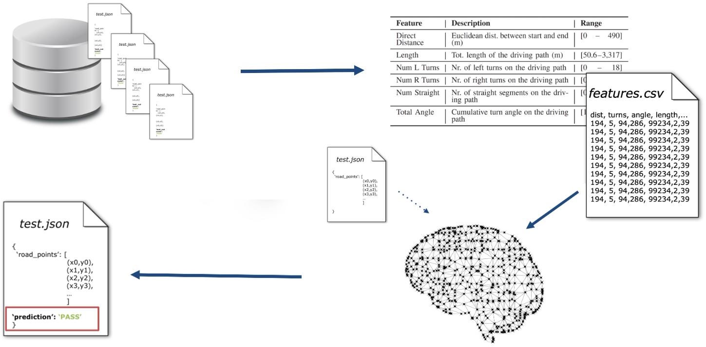

# Test Outcome Prediction



## Evaluate Machine Learning Models

```text
Usage: sdc-scissor evaluate-models [OPTIONS]

  Evaluate different machine learning models with a stratified cross
  validation approach.

Options:
  --csv PATH         Path to road_features.csv
  --models-dir PATH  Directory to store the trained models
  --help
```

```{eval-rst}
.. autofunction:: sdc_scissor.cli.evaluate_models
```

## Predict test outcomes before execution
```text
Usage: sdc-scissor predict-tests [OPTIONS]

  Predict the most likely outcome of a test scenario without executing them in
  simulation.

Options:
  -t, --tests PATH
  -c, --classifier PATH
  --help
```

```{eval-rst}
.. autofunction:: sdc_scissor.cli.predict_tests
```
