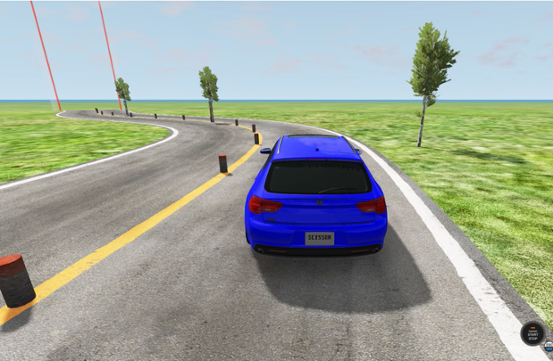

# Test Execution
You can run the tests in simulation environments. For the moment we focus on the BeamNG.tech simulator.
As input, you need to have a directory containing the test specifications in JSON format.
In case you don't have yet any test specification then you should take a look at the [Test Generation](test_generation.md) section to know more about generating test specifications automatically.

```{note}
SDC-Scissor supports currently only BeamNG.tech v0.24.0.2!
```



The general command to run the tests is `lable-tests`, as illustrated in the following listing:
```text
Usage: sdc-scissor label-tests [OPTIONS]

  Execute the tests in simulation to label them as safe or unsafe scenarios.

Options:
  -t, --tests PATH
  --home PATH
  --user PATH
  --rf FLOAT
  --oob FLOAT
  --max-speed FLOAT
  --interrupt / --no-interrupt
  --obstacles / --no-obstacles
  --bump-dist INTEGER
  --delineator-dist INTEGER
  --tree-dist INTEGER
  -fov, --field-of-view INTEGER
  --help
```

```{note}
The command is called `label-tests` since the main purpose for running the tests is to have a labeled dataset.
With a dataset of tests with the according test outcome (i.e., the label), SDC-Scissor can train machine learning models on it.
More information you will find in the [Test Outcome Prediction](machine_learning.md) section.
```


## Options
The command `label-tests` comes with several options.
Those options are mainly about to configure the virtual environment and not the actual road specifications since these are set in the JSON files.

```{eval-rst}
.. autofunction:: sdc_scissor.cli.label_tests
```
