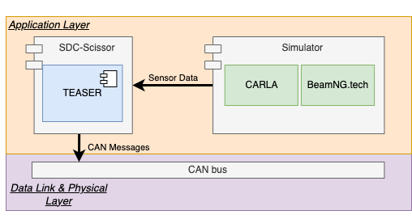

# Test Execution
You can run the tests in simulation environments. For the moment we focus on the BeamNG.tech simulator.
As input, you need to have a directory containing the test specifications in JSON format.
In case you don't have yet any test specification then you should take a look at the [Test Generation](test_generation.md) section to know more about generating test specifications automatically.

```{note}
SDC-Scissor supports currently only BeamNG.tech v0.24.0.2!
```


The general command to run the tests is `lable-tests`, as illustrated in the following listing:
```text
Usage: sdc-scissor label-tests [OPTIONS]

  Execute the tests in simulation to label them as safe or unsafe scenarios.

Options:
  -t, --tests PATH                Path to the directory containing the test
                                  specifications
  --home PATH                     The home directory of the BeamNG.tech
                                  simulator containing the executable
  --user PATH                     The user directory of BeamNG.tech containing
                                  the tech.key file and levels files
  --rf FLOAT                      Risk factor of the AI driving the car
  --oob FLOAT                     The out-of-bound parameter specifying how
                                  much a car is allowed to drive off the lane
  --max-speed FLOAT               The maximum speed the AI is allowed to drive
  --interrupt / --no-interrupt    Indicator if the test executions should stop
                                  when the car violates the OOB criteria
  --obstacles / --no-obstacles    Indicator if there should be obstacles in
                                  the virtual environment
  --bump-dist INTEGER             The distance between the speed bumps
                                  ('obstacles' needs to be true)
  --delineator-dist INTEGER       The distance between the delineators
                                  ('obstacles' needs to be true)
  --tree-dist INTEGER             The distance between the trees ('obstacles'
                                  needs to be true)
  -fov, --field-of-view INTEGER   The field of view angle
  --canbus / --no-canbus          Enable CAN messages
  --can-stdout / --no-can-stdout  Output CAN messages to stdout
  --can-dbc PATH                  Path to CAN database file
  --can-dbc-map PATH              Path to CAN database map json file
  --can-interface TEXT            CAN interface
  --can-channel TEXT              CAN channel
  --can-bitrate PATH              CAN bitrate
  --influxdb-bucket TEXT          InfluxDB bucket to write CAN message to
  --influxdb-org TEXT             InfluxDB organization
  --help                          Show this message and exit.
```

```{note}
The command is called `label-tests` since the main purpose for running the tests is to have a labeled dataset.
With a dataset of tests with the according test outcome (i.e., the label), SDC-Scissor can train machine learning models on it.
More information you will find in the [Test Outcome Prediction](machine_learning.md) section.
```

## TEASER CAN bus component


TEASER's main objective is to extend the test runner of SDC-Scissor to enable CAN bus testing.
The tool uses two open source python libraries; the python-can 2 and cantools 3 packages.
The python-can library allows communication with the CAN bus over specific interfaces (e.g., sockets).
Complementary to the first package, the cantools library provides functionality to compose the can messages to send on the CAN bus.
Specifically, cantools allows the user to specify a CAN database file, which defines how signals are encoded into CAN messages.
The following listing illustrates how the wheel speed, throttle, brake, and steering angle are encoded in a CAN message by specifying it in a CAN database file.

````text
...
BO_ 177 sampleFrame2: 4 Vector__XXX
 SG_ wheelspeed : 16|16@1+ (0.2,0) [0|13107] "rpm" Vector__XXX

BO_ 161 sampleFrame1: 7 Vector__XXX
 SG_ throttle : 16|16@1+ (0.0001,0) [0|1] "%" Vector__XXX
 SG_ brake : 0|16@1+ (0.0001,0) [0|1] "%" Vector__XXX
 SG_ steering : 32|17@1- (0.01,0) [-655.36|655.35] "degree" Vector__XXX
 ...
````

```{eval-rst}
..  youtube:: bUIwvXYC57M
   :width: 695
   :height: 480
```

## Options
The command `label-tests` comes with several options.
Those options are mainly about to configure the virtual environment and not the actual road specifications since these are set in the JSON files.
