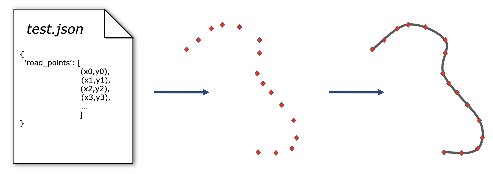

# Test Generation
SDC-Scissor uses state-of-the-art test generators from the previous editions of the
SBST tool competition. The test generators of SDC-Scissor produce sequences of road points,
which represent road points. By interpolating between those road points the actual roads are
created. The following figure illustrates the concept of generating a test case for SDCs
with SDC-Scissor.



The test cases that specifies the road points are stored as JSON files in a provided directory.
With those specified test cases in JSON files you you can run the simulations in the next step.

The following command generates the test cases and stores them as JSON files in a given directory:

````shell
$ poetry run sdc-scissor generate-tests [OPTIONS]
````

